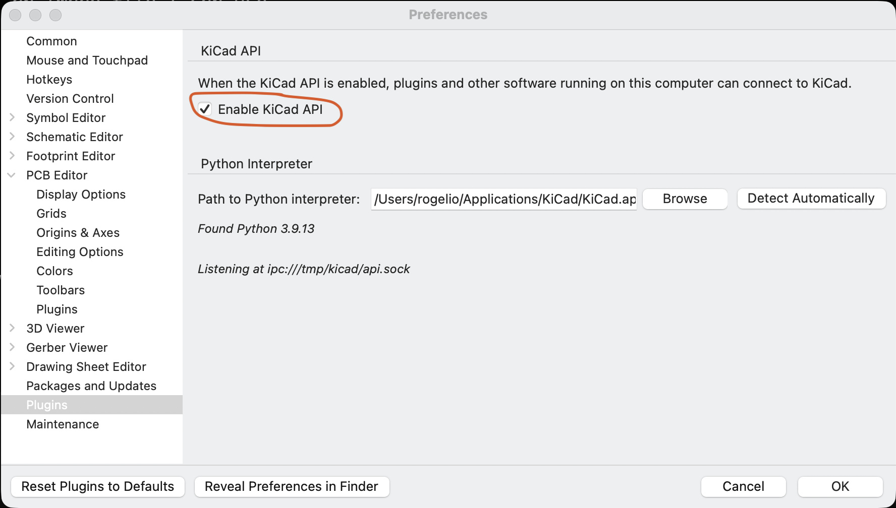

# KiCad Xyce Plugin

KiCad plugin that integrates the Xyce circuit simulator into the KiCad UI, so you can configure and run simulations directly from a schematic workflow.

## Installation

### Step 1: Enable KiCad API

1. Open KiCad
2. Go to **Preferences** → **Settings** → **API**
3. Enable **KiCad API**



### Step 2: Restart KiCad

### Step 3: Download the latest KiCad Xyce Plugin

https://github.com/spice-projects/kicad-xyce-plugin/releases/latest

### Step 4: Install KiCad Xyce Plugin from file

1. Open KiCad
2. Go to **Tools** → **Plugin Manager** (or **Preferences** → **Plugin Manager**)
3. Click **Install from File...** and select the unzipped plugin file


### Step 5: Restart KiCad

Restart KiCad so the newly installed plugin is loaded and registered.

### Step 6: Open KiCad Xyce Plugin from schematics toolbar

Open a schematic project. The plugin appears as a toolbar button in the schematic editor — click it to launch the simulator.


## Current status

- Development status: in progress
- Primary action: Run Xyce Circuit Simulator
- Runtime: native C++23 executable (IPC plugin)

## What this plugin provides

- Native KiCad plugin action to launch the simulator UI
- Simulation command dialog supporting Transient, AC, DC, Harmonic Balance, Noise, Operating Point, and Linear analyses
- Xyce process runner with streamed stdout and stderr handling
- Interactive Slint desktop UI backed by an ImGui plotting surface (ImPlot) with charts and expression plotting
- FFT calculations for transient analysis and STEP visualization
- Persistent plugin configuration for the Xyce executable path
- IPC integration with KiCad via NNG and the vendored KiCad protobuf API

## Repository layout

- `src/`: main source directory containing the plugin logic and files
  - `src/main.cpp`: application entry point
  - `src/app/`: application lifecycle (singleton, platform initialization)
  - `src/core/`: shared utilities (`util`, `view`, `step_information`)
  - `src/plugin.json`: KiCad Plugin and Content Manager (PCM) executable-plugin metadata
  - `src/kicad/`: KiCad IPC connection (NNG), session handling, and netlist source
  - `src/netlist/`: Xyce netlist generation
  - `src/simulation/`: simulation parameter models
  - `src/expression/`: expression parsing/evaluation
  - `src/dsp/`: FFT computation for spectral analysis
  - `src/io/`: Xyce output/raw/FFT file readers
  - `src/charts/`: chart data model and decimation algorithms
  - `src/config/`: plugin configuration
  - `src/ui/`: Slint desktop UI (flat layout: views/presenters, dialog wrappers, platform backends, ImGui/ImPlot charts renderer)
- `netlists/`: sample/test netlists
- `tests/`: C++ unit tests (GoogleTest)
- `xyce-docs/`: vendor-provided Xyce documentation PDFs
- `STYLE-GUIDE.md`: style guidelines for the codebase

## Requirements

- C++23 compiler and CMake 3.12+
- KiCad 10.0 or newer with IPC plugin runtime support
- Xyce executable installed and available on disk
- Dependencies are managed via `vcpkg` (see `vcpkg.json`)

## Local development setup

Configure and build with CMake presets. Dependencies come from vcpkg via the toolchain file.

```bash
cmake --preset debug
cmake --build --preset debug
```

Other presets are available in `CMakePresets.json`: `release` and `profile`.

## Running the plugin locally

The plugin entrypoint/metadata referenced by KiCad lives in `src/plugin.json` and `metadata.json`.

The build produces the `kicad-xyce-plugin` executable under the build directory. It is launched by KiCad over IPC.

## Building the KiCad package

```bash
./build/create-kicad-package.sh <version>
```

The executable defaults to `.build-debug/kicad-xyce-plugin` and can be overridden as the second argument. The result is written to `dist/`.

## Testing

Tests are built alongside the plugin. Run the test executable directly:

```bash
./.build-debug/tests/kicad-xyce-plugin-tests
```

## UI Integration tests

```bash
(cd automation_tests && python3 -m unittest discover -s tests -p "*_test.py")
```

## Configuration

At runtime, the plugin expects a valid path to the Xyce executable. Configure it in the plugin UI via the Configuration dialog, along with analysis-specific simulation settings.

## Troubleshooting

- If simulation fails to start, verify the configured Xyce path points to an executable file
- If the plugin does not run from KiCad, verify KiCad plugin discovery and IPC runtime environment configuration
- If the UI fails to initialize, verify the platform graphics backend (Metal/D3D11/OpenGL) is available

## Contributing

1. Open an issue describing the proposed change
2. Implement and test in a feature branch
3. Submit a pull request with a clear summary and validation notes

## License

Project source code is licensed under Apache-2.0. See LICENSE.

This repository also bundles third-party icon assets from KiCad under CC-BY-SA 4.0 in kicad-icons (and `src/ui/kicad-icons`). See:

- kicad-icons/LICENSE
- kicad-icons/COPYING
- THIRD_PARTY_NOTICES.txt

This repository also bundles third-party Xyce documentation PDFs in xyce-docs. See:

- xyce-docs/Xyce_RG.pdf
- xyce-docs/Xyce_UG.pdf
- xyce-docs/COPYING.XYCE
- THIRD_PARTY_NOTICES.txt

When redistributing this project, include the project LICENSE file and all third-party license and notice files listed above.

Dependencies (Slint, ImGui, ImPlot, spdlog, protobuf, NNG, pocketfft, GoogleTest) are third-party components distributed under their own licenses. See THIRD_PARTY_NOTICES.txt for attribution and redistribution notes.
